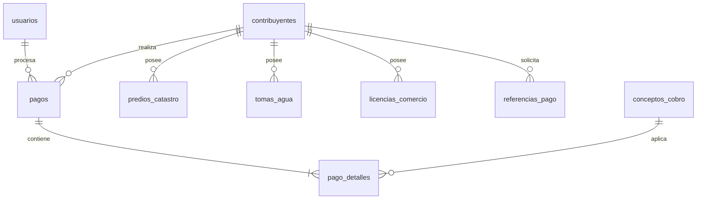

# Contexto Técnico del Proyecto: Sistema de Ingresos Tlapa

Este documento describe la arquitectura, el diseño técnico y los flujos de negocio del **Sistema de Ingresos del Municipio de Tlapa de Comonfort**, diseñado para servir de contexto completo para cualquier agente de Inteligencia Artificial (IA) o desarrollador que trabaje en el proyecto.

---

## 1. Propósito y Arquitectura General

El sistema es una plataforma de recaudación de ingresos municipales (Agua Potable, Impuesto Predial y Licencias de Comercio) que consta de dos componentes principales:
1. **Frontend:** Una SPA desarrollada en React (Vite) con TypeScript, que incluye el panel administrativo y de cobro para cajeros, además del módulo de Kiosco de Autoservicio desatendido para contribuyentes.
2. **Backend:** Un servidor de API REST con Express (Node.js) conectado a una base de datos PostgreSQL local, la cual se sincroniza periódicamente con una base de datos en la nube (Supabase) mediante un worker en segundo plano.

---

## 2. Stack Tecnológico

### Frontend
- **Framework:** React 19.2.4, TypeScript (Configuración de tipos en [tsconfig.json](file:///Users/adrianmendoza/Documents/PROYECTOS2026/TLAPA-MPIO/Sistema-de-ingresos-Tlapa-01/tsconfig.json)).
- **Estilos:** Vanilla CSS / TailwindCSS.
- **Ruteo:** React Router Dom 7.13.0 utilizando `HashRouter`.
- **Librería de Iconos:** `lucide-react`.
- **Integración de Mapas:** `@vis.gl/react-google-maps` (Google Maps JS API Key inyectado vía variables de entorno).

### Backend
- **Framework:** Express 5.2.1.
- **Base de Datos:** PostgreSQL 18.3.
- **Controlador de Base de Datos:** `pg` (PostgreSQL Client).
- **Emulador de Dialecto MySQL:** El archivo [db.js](file:///Users/adrianmendoza/Documents/PROYECTOS2026/TLAPA-MPIO/Sistema-de-ingresos-Tlapa-01/server/config/db.js) cuenta con un middleware local personalizado que traduce sintaxis SQL tipo MySQL a PostgreSQL en caliente (convierte comodines `?` en marcadores numéricos `$1`, `$2` y emula propiedades de retorno como `insertId` y `affectedRows`).
- **Sincronización:** Worker interno ([sync-worker.js](file:///Users/adrianmendoza/Documents/PROYECTOS2026/TLAPA-MPIO/Sistema-de-ingresos-Tlapa-01/server/sync-worker.js)) que consulta registros en estado `'pending'` y los replica en la nube (Supabase).

---

## 3. Estructura de la Base de Datos (Esquema SQL)

El esquema se divide en usuarios administrativos, contribuyentes, activos gravables, conceptos de cobro, transacciones y la tabla del kiosco:

### Tablas Principales
1. **`usuarios`**: Administradores y cajeros. Tienen permisos booleanos (`permiso_agua`, `permiso_catastro`, `permiso_comercio`) y roles (`admin`, `cajero`).
2. **`contribuyentes`**: Padron de ciudadanos con RFC, Nombre Completo, Dirección, Teléfono, y coordenadas GPS de su domicilio.
3. **`predios_catastro`**: Activos de tipo predial vinculados a un contribuyente. Llave primaria: `clave_catastral`.
4. **`tomas_agua`**: Contratos de abastecimiento de agua. Llave primaria: `numero_contrato`.
5. **`licencias_comercio`**: Negocios autorizados. Llave primaria: `numero_licencia`.
6. **`conceptos_cobro`**: Catálogo de impuestos/derechos con precio y frecuencia de cobro (`mensual`, `anual`, `unico`).
7. **`pagos`** (Encabezado) y **`pago_detalles`** (Conceptos liquidados): Registran las transacciones de cobro en ventanilla.
8. **`referencias_pago`**: Órdenes de pago temporales emitidas por el Kiosco desatendido.
   - `folio` (VARCHAR 50 UNIQUE): Número de 12 dígitos generado para escaneo rápido.
   - `monto_total` (NUMERIC).
   - `estado` (VARCHAR: `'pendiente'`, `'pagado'`, `'cancelado'`).
   - `detalles` (JSONB): Almacena la estructura del carrito generado por el Kiosco para ser replicado en cajas.

---

## 4. Flujos Clave de Negocio

### A. Flujo de Kiosco Autónomo (Autoservicio)
1. **Acceso:** Ruta pública unificada en `http://localhost:3000/#/kiosco` (Bypass de seguridad y Layout administrativo implementado en [App.tsx](file:///Users/adrianmendoza/Documents/PROYECTOS2026/TLAPA-MPIO/Sistema-de-ingresos-Tlapa-01/App.tsx)).
2. **Búsqueda Universal:** El contribuyente realiza una consulta de texto en [Kiosco.tsx](file:///Users/adrianmendoza/Documents/PROYECTOS2026/TLAPA-MPIO/Sistema-de-ingresos-Tlapa-01/pages/Kiosco.tsx) (con teclado táctil en pantalla). El backend busca coincidencias parciales por Nombre/RFC o exactas por número de servicio en activos (`tomas_agua`, `predios_catastro`, `licencias_comercio`).
3. **Cálculo de Deudas:** Si se detecta un contribuyente, el backend calcula en tiempo real los adeudos del año fiscal en curso comparando los periodos liquidados en `pago_detalles`.
4. **Emisión de Referencia:** El contribuyente selecciona qué servicios desea liquidar. Al presionar "Imprimir Referencia", se registra un registro `'pendiente'` en `referencias_pago` y se dispara `window.print()` mostrando un ticket térmico de 80mm con un código QR (generado por Google Charts API) que codifica el `folio`.

### B. Flujo de Cobro de Referencia en Caja (Cajero)
1. **Lectura de Ticket:** En el panel del cajero [ModuloPago.tsx](file:///Users/adrianmendoza/Documents/PROYECTOS2026/TLAPA-MPIO/Sistema-de-ingresos-Tlapa-01/pages/ModuloPago.tsx), el cajero escanea el código QR del ticket de referencia en el input dedicado.
2. **Carga Automática:** El sistema llama a `GET /api/kiosco/referencia/:folio`, recupera el contribuyente, obtiene el perfil y puebla el carrito de cobro con los conceptos exactos seleccionados en el Kiosco.
3. **Liquidación:** Al confirmar el cobro en efectivo, se dispara la transacción en [pagos.controller.js](file:///Users/adrianmendoza/Documents/PROYECTOS2026/TLAPA-MPIO/Sistema-de-ingresos-Tlapa-01/server/controllers/pagos.controller.js), registrando el pago en `pagos`/`pago_detalles` y cambiando el estado de la referencia de Kiosco a `'pagado'` de forma atómica.

---

## 5. Archivos Clave del Proyecto

- **[server.js](file:///Users/adrianmendoza/Documents/PROYECTOS2026/TLAPA-MPIO/Sistema-de-ingresos-Tlapa-01/server.js):** Punto de entrada del backend de Express.
- **[db.js](file:///Users/adrianmendoza/Documents/PROYECTOS2026/TLAPA-MPIO/Sistema-de-ingresos-Tlapa-01/server/config/db.js):** Wrapper de conexión a base de datos local PostgreSQL con traducción MySQL a Postgres.
- **[kiosco.controller.js](file:///Users/adrianmendoza/Documents/PROYECTOS2026/TLAPA-MPIO/Sistema-de-ingresos-Tlapa-01/server/controllers/kiosco.controller.js):** Lógica del backend para búsqueda de deudas y folios.
- **[pagos.controller.js](file:///Users/adrianmendoza/Documents/PROYECTOS2026/TLAPA-MPIO/Sistema-de-ingresos-Tlapa-01/server/controllers/pagos.controller.js):** Procesamiento de cobro de deudas y baja de referencias.
- **[App.tsx](file:///Users/adrianmendoza/Documents/PROYECTOS2026/TLAPA-MPIO/Sistema-de-ingresos-Tlapa-01/App.tsx):** Configuración del enrutamiento de la aplicación (bypasses de layout y login para Kiosco).
- **[api.ts](file:///Users/adrianmendoza/Documents/PROYECTOS2026/TLAPA-MPIO/Sistema-de-ingresos-Tlapa-01/services/api.ts):** Cliente API del frontend.
- **[Kiosco.tsx](file:///Users/adrianmendoza/Documents/PROYECTOS2026/TLAPA-MPIO/Sistema-de-ingresos-Tlapa-01/pages/Kiosco.tsx):** Vista táctil de autoservicio de Kiosco (incluye teclado virtual y plantilla de impresión CSS `@media print`).
- **[ModuloPago.tsx](file:///Users/adrianmendoza/Documents/PROYECTOS2026/TLAPA-MPIO/Sistema-de-ingresos-Tlapa-01/pages/ModuloPago.tsx):** Panel administrativo del cajero donde se integró la entrada de folios del Kiosco.
